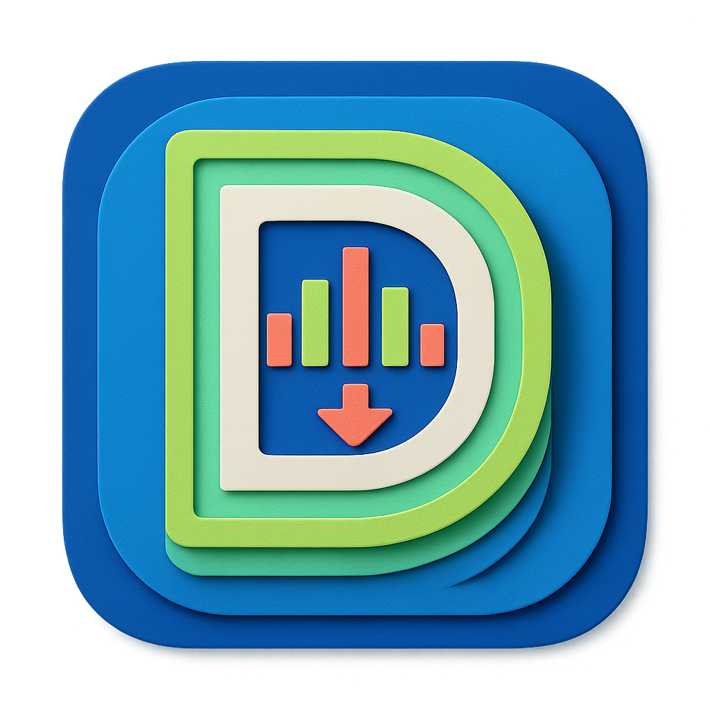
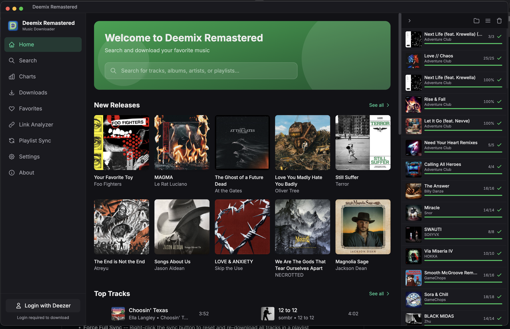
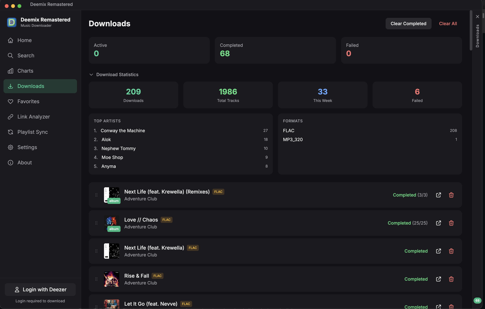
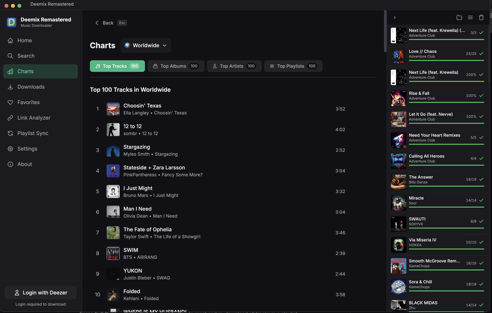
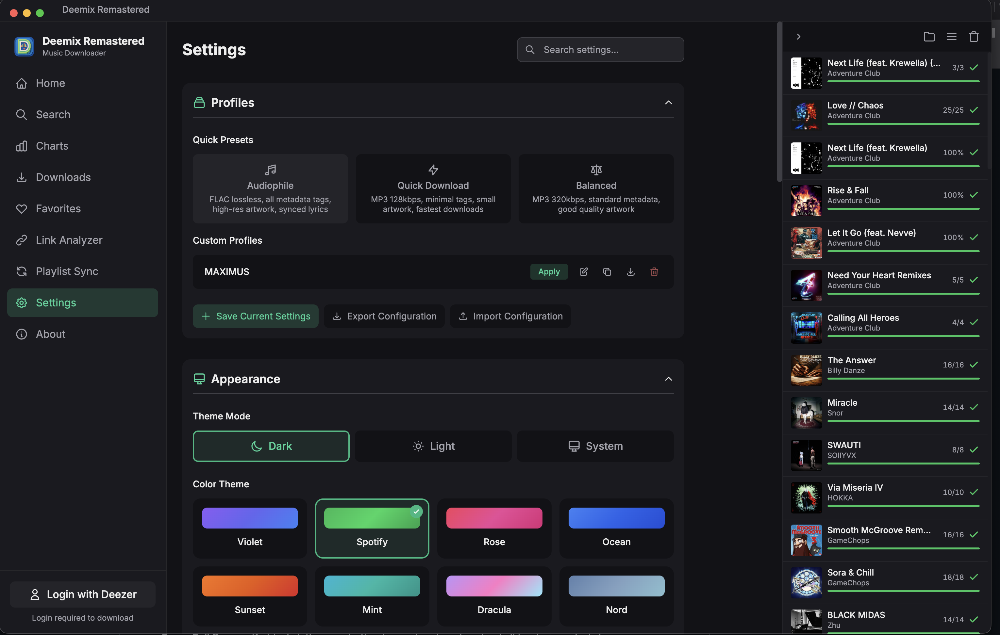

<p align="center">
  
</p>

<h1 align="center">Deemix Remastered</h1>

<p align="center">
  A modern, cross-platform desktop music downloader built entirely from scratch with Electron, Vue 3, and TypeScript.
  <br />
  No code from the original Deemix project - just the same spirit, reimagined with a modern stack.
</p>

<p align="center">
  
  
  
  
  
  
</p>

---

## Features

### Music Discovery & Browsing

- **Home Dashboard** -- New releases, top tracks, top albums, and popular playlists at a glance
- **New Releases Page** -- Dedicated page showing all of Deezer's latest album releases (up to 100), accessible via the **See all** link in the Home page's New Releases section
- **Search** -- Find tracks, albums, artists, and playlists with tabbed result filtering and batch selection
- **Charts** -- Browse global and country-specific charts for tracks, albums, artists, and playlists
- **Artist Pages** -- Full discographies with filters for albums, EPs, singles, compilations, and featured-in releases, with sorting by name or date
- **Sorting** -- Sort favorites and artist discographies by name (A-Z, Z-A), date, or default order
- **Album & Playlist Views** -- Track listings with metadata, selective track downloads, and audio previews
- **Link Analyzer** -- Paste any Deezer or Spotify URL to view content details and download directly (supports share links like `link.deezer.com`)
- **Favorites Import** -- Import your liked tracks, albums, artists, and playlists from your Deezer account

### Downloading

- **Audio Formats** -- MP3 128 kbps, MP3 320 kbps, and FLAC (lossless)
- **Batch Downloads** -- Download entire albums, playlists, or select individual tracks
- **Bulk Link Paste** -- Paste multiple Deezer links into the Search bar or anywhere in the app to queue them all at once
- **Batch Favorites** -- Download all your favorite tracks, albums, or playlists with one click
- **Three-Tier Track Resolution** -- Automatically finds alternative versions (FALLBACK, ISRC) when a track is unavailable — matches old Deemix behavior
- **Download Queue** -- Pause, resume, reorder (drag-and-drop), cancel, and retry downloads (retries stay grouped under the parent album/playlist)
- **Download Next** -- Move pending items to the front of the download queue so they download first
- **Duplicate Album Detection** -- Warns when an album already exists on disk before downloading
- **Download Statistics** -- View total downloads, tracks, top artists, format breakdown, and weekly activity
- **Delete Files** -- Remove downloaded files directly from the app; deletes the entire playlist or album folder
- **Download History** -- Persistent log of all completed and failed downloads (last 500 entries)
- **Smart Fallbacks** -- Automatic bitrate and format fallback when preferred quality is unavailable
- **Concurrent Downloads** -- Configurable from 2 to 50 simultaneous downloads (default: 5)
- **Conflict Handling** -- Skip, overwrite, or rename when files already exist
- **Playlist Diff** -- See how many tracks are new vs already downloaded before re-downloading a playlist
- **Timeout Protection** -- All HTTP calls have connection and stall timeouts to prevent downloads from hanging

### Metadata & Organization

- **ID3 Tagging** -- 21 configurable tag fields including title, artist, album, lyrics, ISRC, BPM, and more
- **Featured Artists** -- All credited artists (main + featured) included in tags with configurable separator
- **M3U Playlists** -- Automatic M3U8 playlist file generation with paths matching actual downloaded files and customizable filename template (`%playlist%`, `%date%`, `%year%`)
- **Album Artwork** -- Embedded and local cover art with configurable size and format (JPEG/PNG)
- **Playlist Artwork** -- Playlist cover image saved as `cover.jpg` in the playlist folder (Deezer, Spotify, and Playlist Sync)
- **Synced Lyrics** -- Optional LRC file generation for synced lyrics
- **Folder Structure** -- Customizable templates for artist, album, playlist, and CD folder organization with variables like `%artist%`, `%album%`, `%year%`, `%explicit%`, `%owner%`, `%date%`
- **Track Naming** -- Template-based naming with variables like `%artist%`, `%title%`, `%tracknumber%`, `%explicit%`
- **Explicit Tag** -- `%explicit%` variable in folder templates separates clean and explicit album versions into different folders

### Spotify Integration

- **Playlist Conversion** -- Convert Spotify playlists to Deezer for downloading
- **Track Matching** -- ISRC-based matching with fallback search and confidence scoring
- **Link Support** -- Paste Spotify URLs directly into the Link Analyzer
- **Batch Downloads** -- Converted playlists download as a single item with unified progress tracking
- **Public/Private Badge** -- Spotify playlists show visibility status in the Link Analyzer

### Playlist Sync

- **Automatic Sync** -- Monitor Spotify and Deezer playlists for new tracks
- **Scheduling** -- Sync on app launch, hourly, every 6/12/24 hours, or manually
- **Diff-Based Downloads** -- Only downloads tracks added since last sync; failed tracks are automatically retried on next sync
- **Force Full Sync** -- Right-click the sync button to reset and re-download all tracks in a playlist
- **Settings-Aware** -- Uses your configured quality, folder structure, and metadata settings
- **Real-Time Progress** -- Live progress bars and status updates during sync

### User Experience

- **8 Color Themes** -- Violet, Spotify, Rose, Ocean, Sunset, Mint, Dracula, and Nord
- **Dark / Light / System Mode** -- Follows your OS preference or set manually
- **Slim Sidebar** -- Compact navigation mode for more screen space
- **Keyboard Shortcuts** -- Quick access to search, downloads, settings, and more
- **Search History** -- Recent searches saved for quick access
- **Context Menus** -- Right-click support for copy/paste operations
- **Offline Detection** -- Banner notification when network connectivity is lost
- **Toast Notifications** -- Non-intrusive feedback for all user actions
- **Auto-Update Checker** -- Notifies you on startup when a new version is available
- **Download Progress in Title Bar** -- See overall download progress in the window title
- **Export/Import Settings** -- Transfer settings between machines via JSON file (credentials excluded)
- **Settings Profiles** -- Save, apply, export, and import named settings configurations

### Supported Languages

Arabic, Chinese (Simplified & Traditional), Croatian, English, Filipino, French, German, Greek, Indonesian, Italian, Korean, Polish, Portuguese (Brazil & Portugal), Russian, Serbian, Spanish, Thai, Turkish, and Vietnamese

### Security

- **Encrypted Credentials** -- ARL tokens and Spotify secrets stored using Electron safeStorage
- **Path Traversal Protection** -- Download paths validated against directory traversal attacks
- **Session Management** -- Automatic expiration detection and re-authentication
- **SSRF Protection** -- Share link resolution validates redirect destinations against domain whitelist
- **URL Validation** -- External URLs validated before opening; blocks unsafe protocols
- **Error Sanitization** -- Internal server errors are sanitized before returning to the client
- **Sandboxed Windows** -- All browser windows use OS-level process isolation

---

## Screenshots

<p align="center">
  
  <br />
  <em>Home Dashboard — New releases, search, and an active downloads panel</em>
</p>

<p align="center">
  
  <br />
  <em>Downloads — Statistics dashboard with top artists, formats, and weekly activity</em>
</p>

<p align="center">
  
  <br />
  <em>Charts — Browse global and country-specific top tracks, albums, artists, and playlists</em>
</p>

<p align="center">
  
  <br />
  <em>Settings — Quick presets, custom profiles, export/import, and 8 color themes</em>
</p>

---

## Downloads

Pre-built binaries are available on the [Releases](../../releases) page.

| Platform | Architecture | Formats |
|----------|-------------|---------|
| **macOS** | Universal (Intel + Apple Silicon), ARM64 (Apple Silicon) | `.dmg` |
| **Windows** | x64, ARM64 | `.exe` (Installer), `.exe` (Portable) |
| **Linux** | x64, ARM64 | `.AppImage`, `.deb` |

### Release Files

#### macOS
- `Deemix Remastered-{version}-universal.dmg` -- Intel + Apple Silicon
- `Deemix Remastered-{version}-arm64.dmg` -- Apple Silicon only

#### Windows
- `Deemix Remastered-Setup-{version}-x64.exe` -- Installer (x64)
- `Deemix Remastered-Setup-{version}-arm64.exe` -- Installer (ARM64)
- `Deemix Remastered-Portable-{version}-x64.exe` -- Portable (x64)
- `Deemix Remastered-Portable-{version}-arm64.exe` -- Portable (ARM64)

#### Linux
- `Deemix Remastered-{version}.AppImage` -- AppImage (x64)
- `Deemix Remastered-{version}-arm64.AppImage` -- AppImage (ARM64)
- `deemix-app_{version}_amd64.deb` -- Debian/Ubuntu package (x64)
- `deemix-app_{version}_arm64.deb` -- Debian/Ubuntu package (ARM64)

---

## Getting Started

### 1. Install the App

Download the appropriate build for your platform from the [Releases](../../releases) page and install it.

### 2. Log In with Your Deezer ARL Token

A Deezer ARL (Authentication) token is required to download music:

1. Log in to [deezer.com](https://www.deezer.com) in your browser
2. Open Developer Tools (`F12`) and go to the **Application** tab
3. Under **Cookies** > `https://www.deezer.com`, find the `arl` cookie
4. Copy its value and paste it into the app's login dialog

> **Note:** A Deezer Premium or HiFi subscription is required for high-quality downloads (FLAC and 320 kbps).

### 3. Browse, Search, or Paste a Link

Use the search bar, browse charts and new releases, or paste a Deezer/Spotify URL into the Link Analyzer to find music.

### 4. Download

Click the download button on any track, album, or playlist and select your preferred quality.

### Keyboard Shortcuts

| Shortcut | Action |
|----------|--------|
| `Cmd/Ctrl + K` or `Cmd/Ctrl + F` | Focus search |
| `Cmd/Ctrl + D` | Go to downloads |
| `Cmd/Ctrl + ,` | Open settings |
| `Cmd/Ctrl + H` | Go to home |
| `Cmd/Ctrl + /` or `Cmd/Ctrl + Shift + ?` | Show shortcuts help |
| `Escape` | Close modals |

### Spotify Playlist Conversion

1. Go to **Settings** and enter your Spotify API credentials (Client ID and Secret)
2. Navigate to **Link Analyzer**
3. Paste a Spotify playlist or album URL
4. The app matches tracks to Deezer using ISRC codes with search fallback
5. Download the matched tracks

---

## Settings Overview

The Settings page offers deep customization organized into these categories:

| Category | Key Options |
|----------|-------------|
| **Appearance** | Theme (8 color themes), dark/light/system mode, slim sidebar, slim downloads |
| **Downloads** | Quality (128/320/FLAC), max concurrent, overwrite mode, bitrate fallback, M3U filename template |
| **Folder Structure** | Create artist/album/playlist/CD folders, templates with `%explicit%`, `%owner%`, `%date%` support |
| **Track Naming** | Templates for single tracks, album tracks, and playlist tracks |
| **Metadata Tags** | Toggle 21 individual ID3 tag fields (title, artist, album, lyrics, ISRC, BPM, etc.) |
| **Album Covers** | Save covers, embedded/local artwork size, JPEG quality, PNG option |
| **Text Processing** | Artist separator, date format, featured artists handling, title/artist casing |
| **Language** | Choose from 22 supported languages |
| **Account** | Deezer ARL token management |
| **Spotify** | Client ID, Client Secret, fallback search toggle |
| **Playlist Sync** | Add Spotify/Deezer playlists, set sync schedule, enable/disable |
| **Profiles** | Save, apply, export, import named settings configurations |
| **Export/Import** | Transfer settings between machines via JSON file |

---

## Building from Source

### Prerequisites

- [Node.js](https://nodejs.org/) 20 or later
- [npm](https://www.npmjs.com/) 9 or later
- [Git](https://git-scm.com/)

**Building Linux `.deb` packages on macOS** additionally requires:

```bash
brew install dpkg fakeroot binutils
```

(`fpm` shells out to `ar`; macOS ships BSD ar which produces malformed Debian archives. The repo includes a `scripts/build-tools/ar` shim that redirects to GNU ar from `binutils` when running on macOS — the npm scripts wire it in automatically.)

### Setup

```bash
git clone https://github.com/DRAZY/deemix-remastered.git
cd deemix-remastered
npm install
```

### Development

```bash
# Start the Vite dev server + Electron
npm run electron:dev

# Or start just the Vite dev server (web only)
npm run dev
```

### Build

```bash
# Build for the current platform
npm run build

# Platform-specific builds
npm run build:mac          # macOS Universal (Intel + Apple Silicon)
npm run build:mac-arm64    # macOS Apple Silicon only
npm run build:win          # Windows x64
npm run build:win-arm64    # Windows ARM64
npm run build:linux        # Linux x64
npm run build:linux-arm64  # Linux ARM64

# Build all platforms
npm run build:all
```

Build output is written to the `release/` directory.

---

## Project Structure

```
deemix-remastered/
├── src/                        # Vue frontend
│   ├── components/             # Reusable UI components (20)
│   ├── composables/            # Composition functions
│   │   ├── useContextMenu.ts       # Right-click menu handling
│   │   ├── useKeyboardShortcuts.ts # Global keyboard shortcuts
│   │   ├── useNetworkStatus.ts     # Online/offline detection
│   │   └── useSearchHistory.ts     # Search history management
│   ├── i18n/locales/           # Translation files (22 languages)
│   ├── services/               # API services
│   │   └── deezerAPI.ts            # Deezer API wrapper with caching
│   ├── stores/                 # Pinia state stores
│   │   ├── authStore.ts            # Authentication & session
│   │   ├── downloadStore.ts        # Download queue management & history
│   │   ├── favoritesStore.ts       # Favorites tracking & Deezer import
│   │   ├── playerStore.ts          # Audio preview playback
│   │   ├── profileStore.ts         # Settings profiles
│   │   ├── settingsStore.ts        # User preferences & export/import
│   │   ├── syncStore.ts            # Playlist sync state
│   │   └── toastStore.ts           # Notification system
│   ├── types/                  # TypeScript type definitions
│   └── views/                  # Page components (13 pages)
├── electron/                   # Electron main process
│   ├── main.ts                 # Window management & IPC
│   ├── preload.ts              # Context bridge
│   ├── server.ts               # Backend server
│   └── services/               # Backend services
│       ├── deezerAuth.ts           # Deezer authentication
│       ├── downloader.ts           # Download engine
│       ├── playlistSync.ts         # Playlist sync engine
│       ├── spotifyAPI.ts           # Spotify API client
│       └── spotifyConverter.ts     # Spotify-to-Deezer conversion
├── public/                     # Static assets & icons
├── dist/                       # Built frontend (generated)
├── dist-electron/              # Built Electron code (generated)
└── release/                    # Packaged builds (generated)
```

---

## Versioning

This project follows [Semantic Versioning](https://semver.org/):

- **PATCH** (e.g., 1.0.1) -- Bug fixes, security patches, dependency updates, translation fixes
- **MINOR** (e.g., 1.1.0) -- New features, new themes, new language support
- **MAJOR** (e.g., 2.0.0) -- Breaking changes, major redesigns, architecture overhauls

See the [Releases](../../releases) page for the full changelog.

---

## Contributing

1. Fork the repository
2. Create a feature branch (`git checkout -b feature/my-feature`)
3. Commit your changes (`git commit -m 'Add my feature'`)
4. Push to the branch (`git push origin feature/my-feature`)
5. Open a Pull Request

Please open an [issue](../../issues) first for major changes to discuss the approach.

---

## License

This project is licensed under the [GPL-3.0 License](LICENSE).

---

## Disclaimer

This application is not affiliated with or endorsed by Deezer or Spotify. Use responsibly and in accordance with your local laws regarding music downloading. Please respect copyright laws and the terms of service of music streaming platforms.

---

<p align="center">
  Made with care by <strong>Team MAXIMUS</strong>
</p>
