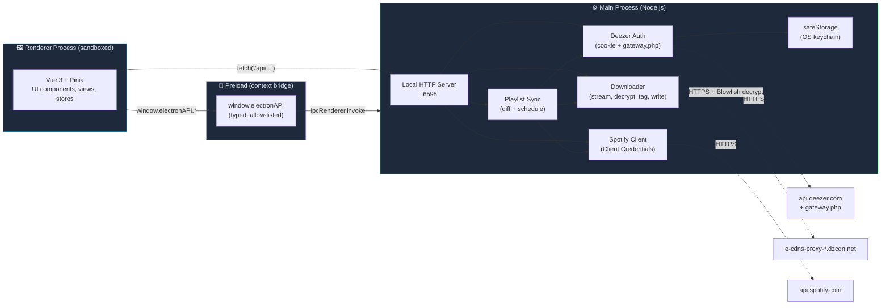

# Architecture

A high-level map of how Deemix Remastered is wired together. Useful for new contributors trying to figure out where to make changes, and for anyone curious how an Electron app keeps its renderer process secure while still talking to streaming services.

---

## The Three Processes

Like every Electron app, this one runs in three distinct contexts:



### 1. Renderer Process — `src/`

Where the UI runs. Sandboxed, no Node.js access, no filesystem access. Pure browser context with a custom title bar (frameless window).

- **Stack:** Vue 3 + Pinia stores + Vue Router + vue-i18n + Tailwind
- **State:** Pinia stores in `src/stores/` (auth, download queue, settings, profiles, sync, toast notifications, favorites, player)
- **Pages:** 13 view components in `src/views/` (Home, Search, Charts, Downloads, Favorites, Album, Artist, Playlist, Link Analyzer, New Releases, Sync, Settings, About)
- **Components:** 20 reusable UI pieces in `src/components/`
- **Talks to backend** via two channels: HTTP fetch to `127.0.0.1:6595` for queryable data, or the `window.electronAPI` bridge for OS-level operations (file dialog, deep link, encrypt secret)

### 2. Preload Bridge — `electron/preload.ts`

Runs in a special privileged context that exposes a small, allow-listed API to the renderer via `contextBridge.exposeInMainWorld`. The renderer cannot bypass this list; this is what keeps the UI sandboxed.

- **Exposes:** `window.electronAPI.*` with strongly-typed methods for window controls, file dialogs, opening external URLs, encrypted storage, login window orchestration, and playlist-sync event subscriptions
- **Type definitions** mirror to renderer-side `src/types/electron.d.ts` so Vue components get autocomplete for the API
- **Boundary:** any new IPC call has to be added in three places — preload exposure, main-process IPC handler, and the renderer-side type. This is intentional friction.

### 3. Main Process — `electron/`

Full Node.js, owns the window lifecycle, runs a local HTTP server, owns the auth session and downloader. This is also where all I/O happens.

#### Local HTTP Server — `electron/server.ts`

Runs on `127.0.0.1:6595` (port shifts on collision). Serves `/api/*` endpoints to the renderer. Routes:

- **Auth:** `/api/auth/{login,login-email,login-captcha,captcha-status,logout,status,health}`
- **Catalog:** `/api/{search,track,album,artist,artist/discography,playlist}`
- **Editorial:** `/api/{chart,chart/countries,editorial/releases,user/favorites}`
- **Spotify:** `/api/spotify/{auth,status,analyze,convert}`
- **Downloads:** `/api/{download,download/album,download/playlist,download/batch,queue,queue/cancel,queue/priority,queue/clear,queue/pause,queue/resume,queue/status}`
- **Sync:** `/api/sync/{playlists,run}`
- **Generic:** `/api/{settings,analyze,health}`

Why a local HTTP server instead of pure IPC? Two reasons. First, the renderer can stream long-lived data (download progress, queue status) with familiar `fetch` patterns instead of subscribing to events. Second, services like the Spotify OAuth callback need a real HTTP listener.

#### Deezer Auth — `electron/services/deezerAuth.ts`

The core of the app. Handles two distinct Deezer API surfaces:

- **Public REST** (`api.deezer.com`) — used for unauthenticated catalog browsing (search, charts, editorial). No cookies needed.
- **Authenticated gateway** (`www.deezer.com/ajax/gw-light.php`) — Deezer's internal RPC endpoint. Used for everything that requires identity: track metadata with stream URLs, license tokens, user data, song metadata with country availability, full discographies. POST with cookies + `api_token`.

Session state lives in-memory: cookies (including `arl`, `sid`, `dzr_uniq_id`), API token, user country, license token. Auth health is monitored via a heartbeat that refreshes the API token periodically and emits `session-health` events.

#### Downloader — `electron/services/downloader.ts`

Streams encrypted track audio from Deezer's CDN, decrypts it (Blowfish, key derived from the track ID), tags the file (ID3 for MP3, FLAC metadata for FLAC), writes it to disk under the configured folder template, and updates the download queue.

Three-tier track resolution: when a requested track isn't available in the requested quality, the downloader falls back to (1) bitrate fallback (lower quality of the same track), (2) FALLBACK ID (the alternative track ID that Deezer's own client uses), (3) ISRC search (find the same recording on a different track ID). Each fallback level is configurable in Settings.

#### Spotify Client — `electron/services/spotifyAPI.ts` + `spotifyConverter.ts`

Client Credentials OAuth (no user login — uses the developer's own Client ID/Secret to fetch public playlists and tracks). Converter takes a Spotify track and finds the best Deezer match: ISRC first (exact), then `track.search` with title+artist (best-effort with confidence scoring).

#### Playlist Sync — `electron/services/playlistSync.ts`

Periodically diffs Spotify and Deezer playlists against a local known-state database, queues newly-added tracks for download, and emits sync-progress events back to the renderer via the preload bridge. Schedule is configurable (on launch / hourly / 6h / 12h / 24h / manual). Force Full Sync (right-click the sync button) wipes the known-state and re-downloads everything.

#### safeStorage Bridge — `electron/main.ts`

Encrypts and decrypts secrets via Electron's `safeStorage` API, which delegates to the OS keychain (Keychain on macOS, libsecret on Linux, DPAPI on Windows). The ARL token and Spotify Client Secret are stored encrypted; settings JSON in `userData/` references them by reference, not value.

---

## Data Flow Examples

### A. Searching for an album

```
User types "Random Access Memories" in search bar
  ↓ (Vue method)
SearchView.performSearch()
  ↓ (HTTP)
GET 127.0.0.1:6595/api/search?type=album&q=...&limit=20
  ↓ (Server: handleSearch)
deezerPublicAPI(`/search/album?q=...&limit=20`)
  ↓ (HTTPS, no auth)
api.deezer.com → JSON
  ↑
Renderer gets album list, renders AlbumCard grid
```

No authentication required. No filesystem access. Pure read-through caching.

### B. Downloading an album in FLAC

```
User clicks Download on an AlbumView
  ↓ (Vue)
downloadStore.addAlbumDownload(album, tracks)
  ↓ (HTTP)
POST 127.0.0.1:6595/api/download/album {albumId, quality:'flac'}
  ↓ (Server: handleDownloadAlbum)
For each track:
  deezerAuth.getTrackData(trackId)        → gateway.php (auth required)
    ← media URL, license token
  downloader.streamTrack(mediaUrl, key)   → e-cdns-proxy-*.dzcdn.net
    ← encrypted bytes
  blowfishDecrypt(bytes, deriveKey(id))
  tagFile(decryptedBuffer, metadata)      → node-id3 / flac-metadata
  fs.writeFile(path, taggedBuffer)
  Server emits queue update via /api/queue
  ↑
Renderer polls /api/queue/status, updates DownloadStore, re-renders queue UI
```

Auth required (cookie session). Filesystem write. Three CDN candidates tried per track (gambleCDNs setting).

### C. Logging in with email + password

```
User enters email/password in LoginModal
  ↓ (IPC, not HTTP — sensitive)
window.electronAPI.deezerLogin.openLoginWindow()
  ↓ (preload bridge)
ipcRenderer.invoke('deezer-login:open')
  ↓ (main process)
Open a sandboxed BrowserWindow → www.deezer.com login flow
User submits credentials in that window (we never see the password)
  ↑
Window detects successful redirect, extracts ARL cookie, returns it
  ↓ (back to renderer via IPC)
electronAPI.safeStorage.encrypt(arl)
  ↓
Encrypted ARL written to userData/credentials.json
Renderer authStore.login(arl) → server validates, session established
```

Password never crosses the IPC boundary. Only the resulting ARL cookie does, and it's encrypted before persistence.

---

## Why This Shape?

**Sandboxed renderer + allow-listed bridge.** Standard Electron security baseline. The UI cannot read arbitrary files, hit arbitrary URLs, or shell out — it can only do what `window.electronAPI` exposes. New capabilities require explicit additions in three places.

**HTTP server in the main process.** Lets the UI use familiar fetch semantics for streaming, polling, and CORS-friendly resource requests. Also serves as the OAuth callback target for Spotify. Bound to `127.0.0.1` only — never reachable from the network.

**In-memory session, encrypted-at-rest credentials.** ARL and Client Secret are decrypted into memory at app start and stay there for the session. Disk storage is encrypted via OS keychain. No plaintext secrets ever land on disk.

**Three-tier downloader fallbacks.** Deezer's catalog isn't fully consistent — the same recording can have different track IDs in different regions, and "the FLAC of this song" sometimes lives on a sister-track ID. The downloader tries the user's requested quality first, then walks down the fallback chain to find any working version before giving up.

---

## Adding a New Feature: Where Does It Live?

| Feature type | Where |
|---|---|
| New page | `src/views/NewView.vue` + entry in `src/router.ts` + sidebar entry in `src/components/Sidebar.vue` + i18n key |
| New API endpoint | `electron/server.ts` route + handler, plus `src/services/deezerAPI.ts` client method |
| New Pinia store | `src/stores/newStore.ts` |
| New OS-level capability (file dialog, etc.) | Three places: `electron/main.ts` (`ipcMain.handle`) + `electron/preload.ts` (`contextBridge` + global type) + `src/types/electron.d.ts` (renderer-side type) |
| New setting | `src/stores/settingsStore.ts` (default + interface) + `src/views/SettingsView.vue` (UI) + electron-side use site if it affects downloads |
| New i18n string | All 22 locale files in `src/i18n/locales/` (English first; others can wait) |
| New Deezer API call | `src/services/deezerAPI.ts` (renderer-side, public REST) or `electron/services/deezerAuth.ts` (`apiCall` for authenticated gateway) |

---

## Stack Summary

- **Runtime:** Electron 35
- **UI framework:** Vue 3 with Composition API + `<script setup>` syntax
- **State:** Pinia (Composition API style stores)
- **Routing:** Vue Router 4
- **i18n:** vue-i18n (22 languages)
- **Styling:** Tailwind CSS 3 with 8 custom color themes
- **Bundler:** Vite 6 with vite-plugin-electron
- **Type safety:** TypeScript 5, `vue-tsc --noEmit` enforced via CI
- **Audio decryption:** `egoroof-blowfish` (CBC mode with Blowfish-derived key per track)
- **Tagging:** `node-id3` for MP3, `flac-metadata` for FLAC
- **Packaging:** electron-builder (DMG, EXE, AppImage, .deb across x64 + ARM64)
- **No tests** — manual QA before each release. Yes, this is a known gap.
