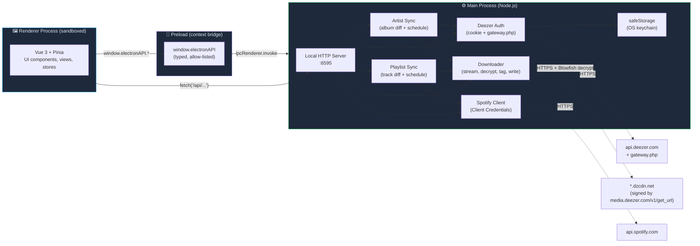

# Architecture

A high-level map of how Deemix Remastered is wired together. Useful for new contributors trying to figure out where to make changes, and for anyone curious how an Electron app keeps its renderer process secure while still talking to streaming services.

---

## The Three Processes

Like every Electron app, this one runs in three distinct contexts:


```mermaid
flowchart LR
    subgraph Renderer["🖼️ Renderer Process (sandboxed)"]
        Vue["Vue 3 + Pinia<br/>UI components, views, stores"]
    end

    subgraph Preload["🔌 Preload (context bridge)"]
        Bridge["window.electronAPI<br/>(typed, allow-listed)"]
    end

    subgraph Main["⚙️ Main Process (Node.js)"]
        Server["Local HTTP Server<br/>:6595"]
        Auth["Deezer Auth<br/>(cookie + gateway.php)"]
        Downloader["Downloader<br/>(stream, decrypt, tag, write)"]
        Spotify["Spotify Client<br/>(Client Credentials)"]
        Sync["Playlist Sync<br/>(track diff + schedule)"]
        ArtistSyncS["Artist Sync<br/>(album diff + schedule)"]
        Storage["safeStorage<br/>(OS keychain)"]
    end

    Vue -->|"fetch('/api/...')"| Server
    Vue -->|"window.electronAPI.*"| Bridge
    Bridge -->|"ipcRenderer.invoke"| Main

    Server --> Auth
    Server --> Downloader
    Server --> Spotify
    Server --> Sync
    Server --> ArtistSyncS
    Auth --> Storage

    Auth -.->|"HTTPS"| DeezerWeb["api.deezer.com<br/>+ gateway.php"]
    Downloader -.->|"HTTPS + Blowfish decrypt"| DeezerCDN["*.dzcdn.net<br/>(signed by media.deezer.com/v1/get_url)"]
    Spotify -.->|"HTTPS"| SpotifyAPI["api.spotify.com"]
    Sync --> Auth
    Sync --> Spotify
    Sync --> Downloader
    ArtistSyncS --> Auth
    ArtistSyncS --> Downloader

    style Renderer fill:#1e293b,color:#e2e8f0,stroke:#0ea5e9
    style Preload fill:#1e293b,color:#e2e8f0,stroke:#a78bfa
    style Main fill:#1e293b,color:#e2e8f0,stroke:#22c55e
```

### 1. Renderer Process — `src/`

Where the UI runs. Sandboxed, no Node.js access, no filesystem access. Pure browser context with a custom title bar (frameless window).

- **Stack:** Vue 3 + Pinia stores + Vue Router + vue-i18n + Tailwind
- **State:** Pinia stores in `src/stores/` (auth, download queue, settings, profiles, playlist sync, artist sync, toast notifications, favorites, player)
- **Favorites persistence:** `src/utils/favoritesStorage.ts` keeps the favourites list in IndexedDB (database `deemix-favorites`, store `kv`, key `favorites`) and migrates the legacy `localStorage` key once on first load (2.6.3, #149: localStorage's 5 MB cap rejected libraries past roughly 3,000 tracks). Backup and restore read and write through the same module. `FavoritesView` renders the tracks tab in windows of 150 behind an IntersectionObserver sentinel so a 7,000-track library paints immediately.
- **Pages:** 18 view components in `src/views/` (Home, Search, Charts, Genres, Downloads, Favorites, Album, Artist, Playlist, User Playlists, Link Analyzer, New Releases, Channel Q and its feeds, Sync, Retag Library, Settings, About). Link Analyzer accepts one link or a pasted list (2.6.2, #142): links are analyzed one at a time into a batch table with per-row status, and the single-link path is unchanged. The Sync page sorts/filters its playlist and artist lists entirely client-side via computed views over the Pinia store arrays — no backend round-trip; sort preference persists in `localStorage` (#90).
- **Components:** 21 reusable UI pieces in `src/components/`
- **Localization (2.6.2):** every user-facing string goes through vue-i18n, `t()` in components and `i18n.global.t()` in stores and composables, with English as the fallback locale. Two invariants, both learned from #148: functional copy (toasts, labels, help text, status words) is never typed into a component, and a new key ships in all 21 locale files in the same commit. The exceptions are the app's own branded labels ("Transfer Rack", "Signal Deck", "AGGREGATE RATE", "Pull the signal"), which stay English by design. `scripts/i18n-check.ts` enforces parity (every locale carries every English key) and flags hard-coded English in templates, toasts and attributes; CI runs it.
- **Player:** 30-second previews from the shared `TrackCard` row. Deezer list endpoints (the favourites import in particular) return slim track objects with no preview URL, so the player resolves the full track on first click and caches the link on the row (#153); Qobuz previews are resolved per play through `/api/qobuz/preview` because their URLs are short-lived signed links.
- **Clipboard:** all copy actions funnel through `useContextMenu().copyToClipboard`, which prefers the native `clipboard:writeText` IPC channel (Electron's clipboard module, no focus or permission constraints), then the browser API, then `execCommand`, and only reports success when a write succeeded (discussion #105).
- **Design system (2.0 "Signal Deck"):** theming is a CSS-variable system in `src/assets/main.css` — each theme block under `[data-theme="..."]` defines RGB-triple variables (`--bg-main`, `--primary-500`, `--logo-*`, …) that `tailwind.config.js` consumes via `rgb(var(--…))`, so Tailwind utility classes are theme-agnostic and switching theme is one attribute flip on `<html>`. `[data-mode="light"]` blocks override per theme (Signal gets a dedicated "paper console" olive variant because chartreuse fails contrast on paper). Fonts (Archivo Black display, IBM Plex Sans/Mono) are bundled via `@fontsource` imports in `src/main.ts` — no network fetch, fully offline. The Signal-only scanline/vignette atmosphere is two pointer-transparent divs in `App.vue` (`.theme-crt`/`.theme-vig`) whose visibility is gated by theme in CSS, off in light mode. **Contrast invariant (2.5.4):** `--fg-muted` must clear WCAG AA (4.5:1) against all three surface tokens (`--bg-main`, `--bg-secondary`, `--bg-tertiary`) in every theme and mode, and secondary text must not stack an opacity modifier on top of it. The palette has no headroom left below `--fg-muted` (the tightest set clears at 4.52:1), so a `text-foreground-muted/NN` on real text will fail somewhere. Opacity modifiers on muted text remain legitimate in exactly two cases, both exempt under WCAG 1.4.3: inactive controls, where the dimming *is* the disabled affordance, and purely decorative graphics such as the `EmptyState` illustrations. Changing any surface token means re-checking the muted colour against it.
- **Directives:** `src/directives/` — `v-tooltip` (registered in `main.ts`) is the standard tooltip primitive going forward, replacing native HTML `title` where reliability matters. It renders a single body-teleported, instantly-shown, correctly-positioned tooltip per element (native `title` was inconsistent — see the Sync-view row icons). Adopted in the Sync view; the rest of the app still uses native `title` until migrated.
- **Talks to backend** via two channels: HTTP fetch to `127.0.0.1:6595` for queryable data, or the `window.electronAPI` bridge for OS-level operations (file dialog, deep link, encrypt secret)

### 2. Preload Bridge — `electron/preload.ts`

Runs in a special privileged context that exposes a small, allow-listed API to the renderer via `contextBridge.exposeInMainWorld`. The renderer cannot bypass this list; this is what keeps the UI sandboxed.

- **Exposes:** `window.electronAPI.*` with strongly-typed methods for window controls, file dialogs, opening external URLs, encrypted storage, the native clipboard, login window orchestration, and playlist-sync event subscriptions
- **Type definitions** mirror to renderer-side `src/types/electron.d.ts` so Vue components get autocomplete for the API
- **Boundary:** any new IPC call has to be added in three places — preload exposure, main-process IPC handler, and the renderer-side type. This is intentional friction.

### 3. Main Process — `electron/`

Full Node.js, owns the window lifecycle, runs a local HTTP server, owns the auth session and downloader. This is also where all I/O happens.

#### Local HTTP Server — `electron/server.ts`

Runs on `127.0.0.1:6595` (port shifts on collision). Serves `/api/*` endpoints to the renderer. Routes:

- **Auth:** `/api/auth/{login,login-email,login-captcha,captcha-status,logout,status,health}`
- **Catalog:** `/api/{search,track,album,artist,artist/discography,playlist}`
- **Editorial:** `/api/{chart,chart/countries,editorial/releases,user/favorites}`. `user/favorites` takes an optional `?type=tracks|albums|artists|playlists` so the renderer can import each section as its own request and show it as it lands (2.6.2, #149); with no type it returns all four.
- **Spotify:** `/api/spotify/{auth,status,analyze,convert}`. Note that `auth` deliberately performs a real read after the client-credentials exchange, not just the token call. Spotify keeps issuing tokens under both failure modes the integration hits (the app owner lacking Premium since 9 March 2026, and Spotify-owned playlists being unreadable), so a token-only check reports success to users for whom every subsequent request will fail. `describeSpotifyError()` in `spotifyAPI.ts` is the single place those statuses are turned into user-facing text; route new Spotify failures through it rather than surfacing raw API messages.
- **Downloads:** `/api/{download,download/album,download/playlist,download/batch,queue,queue/cancel,queue/priority,queue/clear,queue/pause,queue/resume,queue/status}`
- **Playlist Sync:** `/api/sync/{playlists,run,run-all,reset,cancel,resolve-url}`
- **Artist Sync:** `/api/sync/artists{,/run,/run-all,/reset,/cancel}`
- **Generic:** `/api/{settings,analyze,health}`

Why a local HTTP server instead of pure IPC? Two reasons. First, the renderer can stream long-lived data (download progress, queue status) with familiar `fetch` patterns instead of subscribing to events. Second, services like the Spotify OAuth callback need a real HTTP listener.

#### Deezer Auth — `electron/services/deezerAuth.ts`

The core of the app. Handles two distinct Deezer API surfaces:

- **Public REST** (`api.deezer.com`) — used for unauthenticated catalog browsing (search, charts, editorial). No cookies needed.
- **Authenticated gateway** (`www.deezer.com/ajax/gw-light.php`) — Deezer's internal RPC endpoint. Used for everything that requires identity: track metadata with stream URLs, license tokens, user data, song metadata with country availability, full discographies. POST with cookies + `api_token`.

Session state lives in-memory: cookies (including `arl`, `sid`, `dzr_uniq_id`), API token, user country, license token. Auth health is monitored via a heartbeat that refreshes the API token periodically and emits `session-health` events.

#### Downloader — `electron/services/downloader.ts`

Streams encrypted track audio from Deezer's CDN, decrypts it (Blowfish, key derived from the track ID), tags the file (ID3 for MP3, FLAC metadata for FLAC), writes it to disk under the configured folder template, and updates the download queue.

Three-tier track resolution: when a requested track isn't available in the requested quality, the downloader falls back to (1) bitrate fallback (lower quality of the same track), (2) FALLBACK ID (the alternative track ID that Deezer's own client uses), (3) ISRC search (find the same recording on a different track ID). Each fallback level is configurable in Settings. When either outcome occurs it is surfaced in the Downloads list and history: a **Lower bitrate** badge (derived in the UI from requested `quality` vs the server-reported `actualFormat`) and an **Alternate version** badge (driven by a `substituted` flag the downloader sets when it resolves to a different track ID via FALLBACK/ISRC, propagated through the queue payload). This is presentation only — it does not change the byte-exact download or the fallback logic; it exists so a perceived audio difference has a visible, checkable cause (see #99). Since 2.0.0 the Alternate version badge is also a drill-down: `updateAlbumProgress` (`src/stores/downloadStore.ts`) collects a `substitutedTracks[]` list (id, title, artist) from the per-track `substituted` flags, the badge shows a count and opens a modal listing exactly which tracks were substituted, and the list persists into download history. The same pass aggregates in-flight child speeds into the group row's `speed`, so the sidebar sparkline and title-bar meter (which sum `activeDownloads` speeds) read real throughput during album/playlist downloads instead of 0.

Concurrency and pacing: `processQueue()` drains the queue up to `maxConcurrentDownloads` in parallel. An optional **download pacing** gate (issue #86, `setPacing('off' | 'balanced' | 'cautious')`) spaces out new downloads — on `balanced`/`cautious` it holds each download until a jittered minimum gap has elapsed since the last start (base ~2.5s / ~7s respectively, ±50% jitter), so a large queue trickles out instead of bursting (which can trip Deezer's "unusual activity" detection). The gate (`awaitPacingSlot`, a concurrency-safe promise chain) runs inside `processDownload()` **after** the skip-existing check and right before the CDN fetch — so already-downloaded files skip instantly and only real downloads are paced (issue #88). It's `off` by default and a true no-op when off; it throttles only the *start rate*, never concurrency. Because Playlist Sync and Artist Sync enqueue through this same `download()` → `processQueue()` path, pacing covers sync runs automatically. This shared path is also why the concurrency limit is **global**: every download — manual or from any number of concurrent syncs — passes through the single `currentDownloads >= maxConcurrent` gate, so running several syncs at once can never exceed the configured number (a sync's worker pool just queues work and waits on this gate; it does not download independently). The downloader's `maxConcurrent`/pacing are applied from the persisted settings at backend startup (`main.ts` → `server.updateSettings()`), before any launch-triggered sync can run, so a boot-time sync uses the user's saved values rather than the constructor defaults (issue #97). A visible consequence of this global concurrency: an album downloads several tracks at once, so `updateAlbumProgress` (`src/stores/downloadStore.ts`) reports the album progress bar as the **fraction of tracks finished** — `(previouslyCompletedTracks + completedCount) / originalTotalTracks` — rather than a byte-weighted average across in-flight tracks. Byte-weighting made the bar race ahead of the finished count (e.g. 59% next to "1/10") because multiple tracks sit partway through the concurrency gate at once; the fraction always agrees with the "X/Y" count shown beside it, and normalizing against the *original* total keeps it correct for retried albums (whose `trackIds` shrink to just the retry set). Single-track items keep byte-level progress via `updateTrackProgress`.

Queue reordering: the ↑ "Download next" button calls `moveToFront(id)` (jump to front). Drag-and-drop in the Downloads list calls `reorderPending(orderedIds)` (`POST /api/queue/reorder`), which stable-sorts the pending queue to match the dragged order so the visual order and the real download order stay in sync.

Pause/resume: `pauseQueue()` blocks new starts **and** aborts in-flight CDN fetches via per-download `AbortController`s (tracked in `downloadAborts`), re-queuing each aborted track (`pausedDownloadIds`) so it isn't marked failed. `resumeQueue()` clears the flag and re-drains the queue, restarting paused tracks from the beginning (no byte-level resume — negligible for small audio files).

Interrupted-download recovery: the download queue lives only in memory, so anything still in flight when the app closes is lost from the queue. On startup `downloadStore.init()` scans the persisted download list and flips any item still marked `downloading`/`pending` to a retryable `error` state ("Interrupted — click retry to resume"), so it isn't a permanent zombie and the existing Retry control resumes it (already-downloaded tracks skip, so it continues rather than restarts; issue #81). Their ids are also captured in `interruptedDownloadIds`. The opt-in **`resumeInterruptedOnStartup`** setting (off by default, issue #98) then auto-runs that resume: `App.vue` calls `downloadStore.resumeInterruptedDownloads()` **after** `authStore.init()` and only when logged in (a resume re-queues real downloads through the `add*Download` → server path, which hits Deezer), reusing the same `retryDownload` path and the boot-applied concurrency/pacing limits (#97). Refresh/retag items are excluded from both the flag and the resume.

#### Retagger — `electron/services/retagger.ts`

Rewrites tags on *existing* `.mp3`/`.flac` files without re-downloading — the audio stream is left byte-identical (merge semantics: only enabled fields are touched, everything else and embedded artwork is preserved). Resolves metadata from Deezer's **public** API (no ARL/login), matching each file by the ISRC stored in its tags; for an album folder it resolves the one authoritative album and maps tracks into it so track numbers/totals come from the right edition rather than a single-release lookup. Powers both the standalone **Retag Library** page and the per-album/playlist **Refresh tags** action (which the downloader calls directly with the data it already holds). Tag-writing mirrors the download path field-for-field, so a tag added to downloads (e.g. `RELEASETYPE`) is backfillable here too. The opt-in `replayGain` tag is written on all three paths from a single shared `replayGainString()` helper: it maps Deezer's per-track `GAIN` value to a `REPLAYGAIN_TRACK_GAIN` frame (MP3 `TXXX` / FLAC Vorbis) using the original Deemix formula `-(GAIN + 18.4)`, so ReplayGain-aware players can normalize playback loudness. It is metadata only (audio bytes untouched) and default-off — unlike the default-on `RELEASETYPE`, it uses a strict truthy opt-in gate on every path, including the refresh fallback.

#### Spotify Client — `electron/services/spotifyAPI.ts` + `spotifyConverter.ts`

Client Credentials OAuth (no user login — uses the developer's own Client ID/Secret to fetch public playlists and tracks). Converter takes a Spotify track and finds the best Deezer match: ISRC first (exact), then `track.search` with title+artist (best-effort with confidence scoring).

#### Playlist Sync — `electron/services/playlistSync.ts`

Periodically diffs Spotify and Deezer playlists against a local known-state database, queues newly-added tracks for download, and emits sync-progress events back to the renderer via the preload bridge. Schedule is configurable (on launch / hourly / 6h / 12h / 24h / manual). Force Full Sync (right-click the sync button) wipes the known-state and re-downloads everything. State persisted at `userData/playlist-sync.json`.

#### Artist Sync — `electron/services/artistSync.ts`

Parallel engine to Playlist Sync, structurally identical but operating on a different diff key. Watches pinned Deezer artists' discographies via `/artist/{id}/albums` and diffs against `knownAlbumIds[]` rather than a track list — the diff unit is the **album**, not the track. Three first-sync modes determine first-run behavior: `subscribe-forward` (default; captures the current discography as already-known without downloading anything, only future releases trigger downloads), `download-backlog` (download the entire filtered discography), `date-threshold` (download from `minReleaseDate` forward). Per-artist filters control which release types (album / EP / single / compilation / feature) are pulled. Caps at 3 concurrent artist syncs; per-track parallelism still flows through the downloader's `maxConcurrentDownloads`. Shares the download-settings provider with playlist sync so quality, folder structure, templates, and metadata stay consistent across both. State persisted at `userData/artist-sync.json`, independent from `playlist-sync.json`. Pinia counterpart is `useArtistSyncStore`; IPC channels are `artistSync:start`/`progress`/`complete`/`error`.

**Completion ledger & retry (#93).** An album earns a `knownAlbumIds[]` entry — which permanently excludes it from future syncs — **only when every track is accounted for**, never on partial success. Each track failure is classified from the downloader's `progress.errorDetails.code`: permanent (`GEO_RESTRICTED`/`TRACK_UNAVAILABLE`) failures are accepted (the album is marked known and surfaced in `failedAlbums` as "unavailable in your region"), while transient failures (timeouts, quota, empty responses, network) keep the album **out** of `knownAlbumIds` and record it in a persisted `partialAlbums[]` ledger so the next sync retries only the missing tracks (the downloader skips files already on disk). Retries are bounded by `RETRY_CAP` (3) — after which the album is accepted and surfaced — so nothing churns forever. This fixed albums being marked done-without-files and then silently skipped. `resetArtist` (Force Full Sync) clears `knownAlbumIds`, `failedAlbums`, and `partialAlbums`. The pin-from-Favourites flow (`FavoritesView.vue`) prompts for the first-sync mode (default `download-backlog`) instead of silently using `subscribe-forward`.

#### Deezer Public API Client — `electron/services/deezerPublicApi.ts`

Shared, paced, quota-aware client for the public Deezer API (`api.deezer.com`) in the main process. Exists because the public API enforces a per-IP request quota: a burst of raw `https.get` calls (artist sync enumerating a 90-release discography, or several syncs at once) trips it, Deezer returns `{ error: { code: 4, type: 'Quota' } }` with HTTP 200, and unprotected callers silently drop whatever caught the error (root cause of #84 *and* #93). Two defenses: (1) a **global, serialized, jittered pacing gate** enforces a minimum gap between request *starts* across all concurrent callers, so a burst can't form; (2) **exponential-backoff-with-jitter retry** on quota/transient errors so an item that does trip recovers instead of dropping. `fetchDeezerPublicJson()` and `fetchDeezerPublicPaginated()` are the entry points; both sync engines route their `/artist/{id}/albums`, `/album/{id}/tracks`, and `/playlist/{id}/tracks` lookups through them. The renderer-side equivalent (`src/services/deezerAPI.ts`) already had this for the manual discography path; this is its main-process counterpart.

#### Library Index — `electron/services/libraryIndex.ts`

Backs the opt-in "skip duplicate tracks by ISRC" feature (#91/#92). A persistent map of **ISRC → on-disk path** stored at `userData/library-index.json`, written race-safe via `safeWriteJson` + a serialized save-promise chain (same pattern as the sync engines). The downloader consults it inside `processDownload`, **before** pacing and the CDN fetch: when `options.skipDuplicateTracks` is set and the track has an ISRC already in the index (and the indexed file still exists on disk — stale entries self-evict), the download is skipped instantly and completed with `skippedAsDuplicate`. Identity is the ISRC, not the filename, so the same recording on a different album/single/compilation is recognized as a duplicate even though its path differs. The index is populated on every successful download (and on skip-existing), and can be backfilled over a pre-existing library via `buildFromFolder()` (reuses retagger's `readIsrc` for MP3 + FLAC), exposed at `POST /api/library/reindex` and the Settings "Index existing library" button. The setting is threaded through every download path — single/album/playlist/batch in `server.ts` plus both sync engines via their settings providers in `main.ts`. Off by default; tracks without an ISRC are never deduped; nothing is ever deleted.

#### safeStorage Bridge — `electron/main.ts`

Encrypts and decrypts secrets via Electron's `safeStorage` API, which delegates to the OS keychain (Keychain on macOS, libsecret on Linux, DPAPI on Windows). The ARL token and Spotify Client Secret are stored encrypted; settings JSON in `userData/` references them by reference, not value.

---

## Data Flow Examples

### A. Searching for an album

```
User types "Random Access Memories" in search bar
  ↓ (Vue method)
SearchView.performSearch()
  ↓ (HTTP)
GET 127.0.0.1:6595/api/search?type=album&q=...&limit=20
  ↓ (Server: handleSearch)
deezerPublicAPI(`/search/album?q=...&limit=20`)
  ↓ (HTTPS, no auth)
api.deezer.com → JSON
  ↑
Renderer gets album list, renders AlbumCard grid
```

No authentication required. No filesystem access. Pure read-through caching.

### B. Downloading an album in FLAC

```
User clicks Download on an AlbumView
  ↓ (Vue)
downloadStore.addAlbumDownload(album, tracks)
  ↓ (HTTP)
POST 127.0.0.1:6595/api/download/album {albumId, quality:'flac'}
  ↓ (Server: handleDownloadAlbum)
For each track:
  deezerAuth.getTrackData(trackId)        → gateway.php (auth required)
    ← media URL, license token
  downloader.streamTrack(mediaUrl, key)   → *.dzcdn.net (URL signed by Media API)
    ← encrypted bytes
  blowfishDecrypt(bytes, deriveKey(id))
  tagFile(decryptedBuffer, metadata)      → node-id3 / flac-metadata
  fs.writeFile(path, taggedBuffer)
  Server emits queue update via /api/queue
  ↑
Renderer polls /api/queue/status, updates DownloadStore, re-renders queue UI
```

Auth required (cookie session). Filesystem write. The media URL comes from Deezer's `get_url` endpoint (validated TLS) and the encrypted stream is decrypted client-side.

**Shared album context.** Folder structure (incl. `CD1`/`CD2` subfolders), folder/file naming, and album-level tags all derive from an album *context* object built by `buildAlbumContext` in `electron/services/albumContext.ts` — the **single source of truth**, used by every download path so they produce identical results:
- **Album-page download** (`handleDownloadAlbum`) builds it from `/album/{id}` + the tracklist.
- **Retry failed tracks (#94)** re-downloads individual tracks via `POST /api/download` (single-track route). The renderer forwards the parent item's context — album items send `albumId`, playlist items send `playlistName`. On an album retry the server rebuilds the context from `albumId` via `fetchAlbumContext` → `buildAlbumContext`, sets `isSingle: false`, and reuses the track's `disk_number` for CD folders. Standalone singles send neither and are filed in the artist root.
- **Artist sync (#95)** builds the same context per album (one paced `/album/{id}` lookup) and passes it plus each track's `disk_number`, so synced multi-disc albums get CD subfolders and synced downloads match album-page downloads for naming, RELEASETYPE tag, and `%upc%`/`%label%` templates. Previously sync passed neither, so the CD-folder rule (`createCDFolder && discNumber && totalDiscs > 1`) never fired.

### C. Logging in with email + password

```
User enters email/password in LoginModal
  ↓ (IPC, not HTTP — sensitive)
window.electronAPI.deezerLogin.openLoginWindow()
  ↓ (preload bridge)
ipcRenderer.invoke('deezer-login:open')
  ↓ (main process)
Open a sandboxed BrowserWindow → www.deezer.com login flow
User submits credentials in that window (we never see the password)
  ↑
Window detects successful redirect, extracts ARL cookie, returns it
  ↓ (back to renderer via IPC)
electronAPI.safeStorage.encrypt(arl)
  ↓
Encrypted ARL written to userData/credentials.json
Renderer authStore.login(arl) → server validates, session established
```

Password never crosses the IPC boundary. Only the resulting ARL cookie does, and it's encrypted before persistence.

---

## Why This Shape?

**Sandboxed renderer + allow-listed bridge.** Standard Electron security baseline. The UI cannot read arbitrary files, hit arbitrary URLs, or shell out — it can only do what `window.electronAPI` exposes. New capabilities require explicit additions in three places.

**Fused Electron binary.** `electronFuses` in `package.json` flips Electron's build-time fuses when electron-builder packages the app: `RunAsNode`, `EnableNodeOptionsEnvironmentVariable` and `EnableNodeCliInspectArguments` are off, `OnlyLoadAppFromAsar` and `EnableEmbeddedAsarIntegrityValidation` are on. The signed binary ignores `ELECTRON_RUN_AS_NODE`, `NODE_OPTIONS` and `--inspect`, and refuses to load app code that is not the shipped, hash-checked `app.asar`. Because `RunAsNode` is off, the main process must not use `child_process.fork`; use Electron's `utilityProcess` if a standalone Node worker is ever needed.

**HTTP server in the main process.** Lets the UI use familiar fetch semantics for streaming, polling, and CORS-friendly resource requests. Also serves as the OAuth callback target for Spotify. Bound to `127.0.0.1` only — never reachable from the network.

**In-memory session, encrypted-at-rest credentials.** ARL and Client Secret are decrypted into memory at app start and stay there for the session. Disk storage is encrypted via OS keychain. No plaintext secrets ever land on disk.

**Three-tier downloader fallbacks.** Deezer's catalog isn't fully consistent — the same recording can have different track IDs in different regions, and "the FLAC of this song" sometimes lives on a sister-track ID. The downloader tries the user's requested quality first, then walks down the fallback chain to find any working version before giving up.

---

## Adding a New Feature: Where Does It Live?

| Feature type | Where |
|---|---|
| New page | `src/views/NewView.vue` + entry in `src/router.ts` + sidebar entry in `src/components/Sidebar.vue` + i18n key |
| New API endpoint | `electron/server.ts` route + handler, plus `src/services/deezerAPI.ts` client method |
| New Pinia store | `src/stores/newStore.ts` |
| New OS-level capability (file dialog, etc.) | Three places: `electron/main.ts` (`ipcMain.handle`) + `electron/preload.ts` (`contextBridge` + global type) + `src/types/electron.d.ts` (renderer-side type) |
| New setting | `src/stores/settingsStore.ts` (default + interface) + `src/views/SettingsView.vue` (UI). If the server needs it, four more links or it silently does nothing (#131, #134, #141): `ServerSettings` type and default plus the boolean validation list in `electron/server.ts`, every `downloader.download({...})` option site, the `settingsToSync` allowlist in `src/stores/downloadStore.ts`, and the profile key list in `src/stores/profileStore.ts`. Re-run the allowlist sweep in `docs/AUDIO_FIDELITY_AUDIT.md` and prove the setting both ways through the real app before shipping. Renderer-only settings (appearance) skip the server links but must survive profile switches. |
| New i18n string | Never hard-code it. Add the key to `src/i18n/locales/en.json` and to all 20 other locale files in the same commit; `bun scripts/i18n-check.ts` must pass. Branded labels are the only exemption. |
| New Deezer API call | `src/services/deezerAPI.ts` (renderer-side, public REST) or `electron/services/deezerAuth.ts` (`apiCall` for authenticated gateway) |

---

## Stack Summary

- **Runtime:** Electron 43 (Chromium 150, Node 24)
- **UI framework:** Vue 3 with Composition API + `<script setup>` syntax
- **State:** Pinia 4 (Composition API style stores)
- **Routing:** Vue Router 5
- **i18n:** vue-i18n, 21 languages, all complete to key parity since 2.6.2 and checked by `scripts/i18n-check.ts`
- **Styling:** Tailwind CSS 3 over a CSS-variable theme system — 9 color themes (Signal default) with per-theme light-mode variants; Archivo Black + IBM Plex Sans/Mono bundled via @fontsource
- **Bundler:** Vite 8 with vite-plugin-electron
- **Type safety:** TypeScript 5, `vue-tsc --noEmit` enforced via CI
- **Audio decryption:** `egoroof-blowfish` (CBC mode with Blowfish-derived key per track)
- **Tagging:** `node-id3` for MP3, `flac-metadata` for FLAC
- **Packaging:** electron-builder (DMG, EXE, AppImage, .deb across x64 + ARM64)
- **No tests** — manual QA before each release. Yes, this is a known gap.
